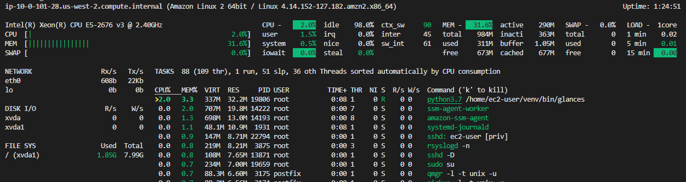
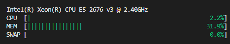
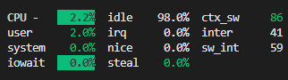
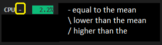
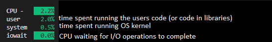
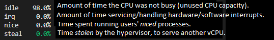
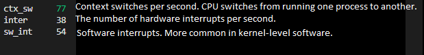
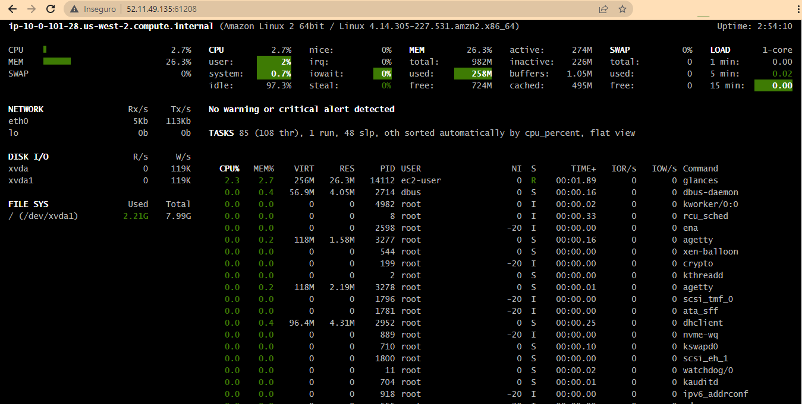

# How to use GLANCES to monitor Linux load
## Load average
The Load Average in Linux is an essential metric to monitor the usage of system resources easily. Keeping the load average in check helps ensure that your system does not experience a crash or sluggish sessions.
## Lab configuration
### AWS EC2 instance (created with terraform, see [here](terraform/main.tf)):
* t2.micro
* 1vCPU
* 1GiB memory
* Amazon Linux 2023 64-bit (x86) (RHEL 7)
* storage 8GiB gp3
* Info about the operating system:
> cat /etc/os-release 

    NAME="Amazon Linux"
    VERSION="2"
    ID="amzn"
    ID_LIKE="centos rhel fedora"
    VERSION_ID="2"
    PRETTY_NAME="Amazon Linux 2"
    ANSI_COLOR="0;33"
    CPE_NAME="cpe:2.3:o:amazon:amazon_linux:2"
    HOME_URL="https://amazonlinux.com/"

### Install GLANCES
> sudo yum update 
> sudo yum install https://dl.fedoraproject.org/pub/epel/epel-release-latest-7.noarch.rpm 
> sudo yum install glances

### Inspecting the results
* HEADER
> ip-10-0-101-28.us-west-2.compute.internal (Amazon Linux 2 64bit / Linux 4.14.152-127.182.amzn2.x86_64) Uptime: 1:34:54 
The header displays the hostname, the OS version and release and the Uptime.

* QUICKLOOK
Shows the CPU, MEM and SWAP usage in a bar view.
  *   Click '3' to enable/disable;
  *   Click '1' to show CPU usage per each CPU.

* CPU

*   CPU trend comparing to comparing to the 6 latests refreshs:

*   CPU detailed:

### SERVER / CLIENT
It's possible to monitor a machine from another. But, I only could make it work when installed the same version of Glances in both machines.
* On server:
> glances -s 
* On client:
> glances -c SERVERIP 
* It's necessary to open the port 61209 on the server's firewall.

### GLANCES WEB
* It's possible to publish Glances on the web.
* On the server:
> glances -w  
* Open port 61208 on the server's firewall
* On the browser:
> http://SERVERIP:61208 

